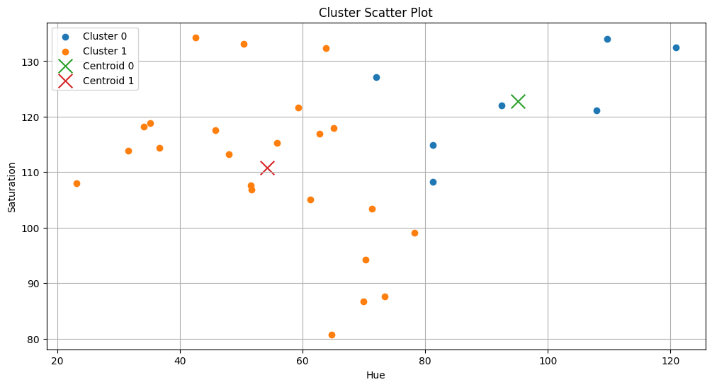
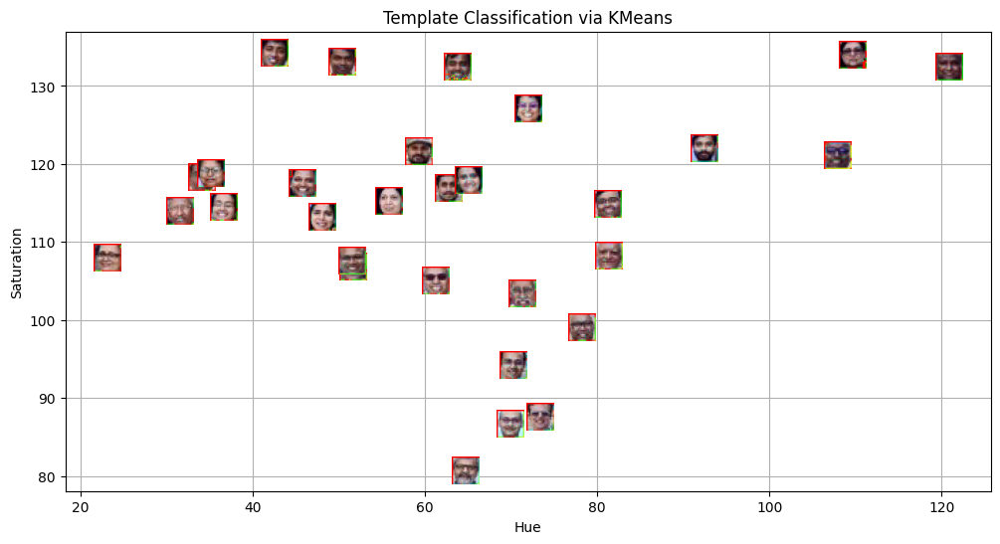
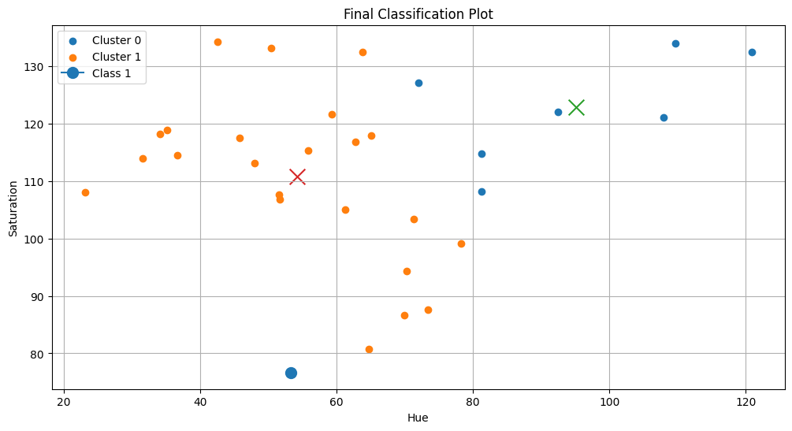

<h1>Lab 5 Summary: Face Detection and K-Means Clustering</h1>

   <h3>Aim</h3>
    
The primary objective of this lab was to implement an automated computer vision pipeline to detect multiple faces in a group photograph and perform unsupervised categorization based on their specific color features.

    <h3>Methodology</h3>
 <ul>
        <li><strong>Face Detection:</strong> Identifies face regions in a group photo using the Haar Cascade classifier from OpenCV.</li>
        <li><strong>Feature Extraction:</strong> Converts the detected face regions into the <b>HSV</b> color space to calculate the average <b>Hue</b> and <b>Saturation</b> for each face.</li>
        <li><strong>Unsupervised Clustering:</strong> Utilizes the <b>K-Means algorithm</b> to group the faces into two distinct clusters based on their color similarities.</li>
        <li><strong>Validation & Visualization:</strong> Generates a scatter plot using <i>AnnotationBbox</i> to overlay actual face images onto their feature coordinates and validates the model by classifying a new template face.</li>
    </ul>

   <h3>Key Findings</h3>
    <ul>
        <li><strong>Similarity Measurement:</strong> <b>Euclidean Distance</b> was successfully used as the metric to calculate straight-line distances between data points in the Hue-Saturation space.</li>
        <li><strong>Algorithm Behavior:</strong> A low 'K' value (number of clusters) was found to increase model variance (leading to potential overfitting), while a high 'K' value increases bias (leading to potential underfitting).</li>
        <li><strong>Distance Metric Efficiency:</strong> While <b>Euclidean distance</b> is standard for shortest-path calculation, other metrics like <b>Manhattan distance</b> can be more effective in high-dimensional sparse data environments.</li>
    </ul>

   <h3>Conclusion</h3>
    
The lab successfully demonstrated that unsupervised learning, specifically K-Means clustering, is an effective way to categorize visual data without predefined labels. It highlighted that the choice of distance metrics and the proper balance of bias and variance are critical for building generalized machine learning models. Additionally, the role of <b>cross-validation</b> was established as a vital step in ensuring a model performs accurately on new, unseen data.

IMAGES: 

</html>
