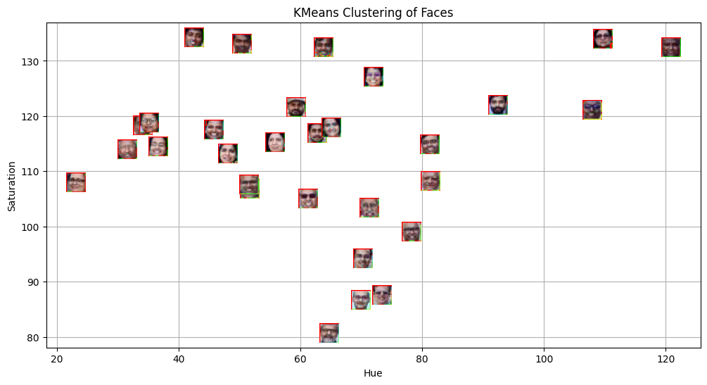

   <h1>Lab 5: Face Detection and Unsupervised Categorization</h1>

   
<strong>Name::</strong> Sartajdeep Singh (U20240121)

  

  <h3>Implementation Details</h3>
    
In this lab, I implemented a complete computer vision pipeline to detect and group faces based on their visual features:

        <ul>
        <li><strong>Face Detection:</strong> Used OpenCV's Haar Cascade classifier to locate multiple faces within a group photograph.</li>
        <li><strong>Feature Extraction:</strong> Converted detected face regions into the <b>HSV (Hue, Saturation, Value)</b> color space. I calculated the <b>Mean Hue</b> and <b>Mean Saturation</b> for each face to represent them as numerical data points.</li>
        <li><strong>Unsupervised Clustering:</strong> Implemented the <b>K-Means algorithm</b> to automatically group these faces into two distinct clusters based on their color similarities.</li>
        <li><strong>Template Prediction:</strong> Used the trained K-Means model to classify a new "template" face into one of the existing clusters.</li>
    </ul>

  <h3>Metrics and Concepts Used</h3>
    <ul>
        <li><strong>Distance Metric:</strong> Used <b>Euclidean Distance</b> to measure the similarity between face features during the clustering process.</li>
        <li><strong>Performance Metric:</strong> Evaluated model error using <b>Root Mean Squared Error (RMSE)</b>.</li>
        <li><strong>Theoretical Analysis:</strong> The lab includes a report covering:
            <ul>
                <li>Comparison of distance metrics (Manhattan, Mahalanobis, Chebyshev, Minkowski, and Cosine).</li>
                <li>Impact of the <b>Bias-Variance Tradeoff</b> on K-Nearest Neighbors (KNN).</li>
                <li>The role of <b>Cross-Validation</b> in ensuring model generalization.</li>
            </ul>
        </li>
    </ul>

  <h3>Visualization</h3>
    
Generated a scatter plot using <i>AnnotationBbox</i> that overlays the actual face images onto their respective coordinates in the Hue-Saturation feature space for intuitive cluster verification.

</body>
IMAGES: 

</html>
